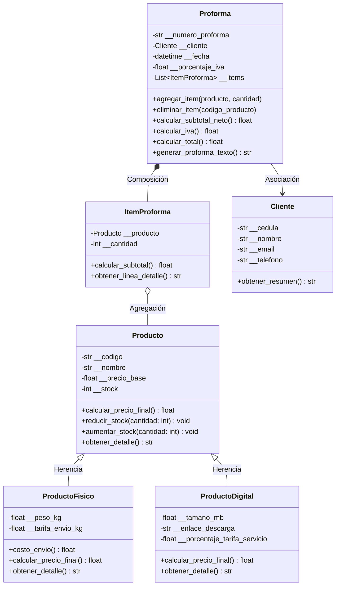

# 🏢 Sistema de Facturación & Proformas Comerciales — Isoglobaltech
### Actividad Semanas 1 y 2: Programación Estructurada (Python)

[](https://www.python.org/)
[]()
[](https://www.uees.edu.ec/)
[]()

Sistema de gestión comercial y emisión de facturas/proformas interactivo desarrollado para la empresa **Isoglobaltech** dentro de la asignatura de **Programación Estructurada** en la **Universidad Espíritu Santo (UEES)**.

El sistema modela un flujo de ventas real con catálogo de productos tangibles e intangibles, validaciones de encapsulación estricta, herencia con `super()`, polimorfismo y composición para el cálculo dinámico de subtotales e impuestos.

---

## 📌 Principios de POO Implementados

### 🔹 Semana 1: Clases, Objetos, Encapsulación y Modelado UML
* **Encapsulamiento estricto:** Todos los atributos de las entidades son privados (`__atributo`) para proteger la integridad del estado interno del objeto.
* **Getters y Setters:** Implementación elegante con decoradores `@property` y `@<atributo>.setter`.
* **Validaciones de negocio:**
  * Cédula/RUC con longitud mínima válida.
  * Formato de correo electrónico validado mediante expresiones regulares (Regex).
  * Precios base y pesos estrictamente mayores a 0.
  * Control de stock mediante números enteros no negativos.

### 🔹 Semana 2: Herencia, Polimorfismo y Composición
* **Herencia y `super()`:**
  * `ProductoFisico` hereda de `Producto` incorporando atributos de peso (`peso_kg`) y tarifa por kilogramo (`tarifa_envio_kg`).
  * `ProductoDigital` hereda de `Producto` incorporando tamaño (`tamano_mb`), enlace de descarga (`enlace_descarga`) y porcentaje de servicio digital (`porcentaje_tarifa_servicio`).
* **Polimorfismo (Sobrescritura de métodos):**
  * Sobrescritura del método `calcular_precio_final()` en cada subclase para calcular de manera diferenciada el precio según su naturaleza (agregando flete para físicos o tarifa de plataforma para digitales).
* **Composición:**
  * La clase `Proforma` contiene y administra una colección de instancias de `ItemProforma`. La proforma es responsable del ciclo de vida de los ítems, descontando y devolviendo stock automáticamente.
* **Asociación:**
  * La proforma se asocia con la clase `Cliente` para registrar los datos fiscales y de contacto del comprador.

---

## 🏗️ Estructura del Repositorio

```text
tarea PE/
├── src/
│   ├── __init__.py           # Exportación del paquete modular
│   ├── cliente.py           # Clase Cliente (Encapsulación y validaciones)
│   ├── producto.py          # Clase base Producto (Semana 1)
│   ├── producto_fisico.py   # Subclase ProductoFisico (Herencia y cálculo de envío)
│   ├── producto_digital.py  # Subclase ProductoDigital (Herencia y tarifa digital)
│   ├── item_proforma.py     # Clase ItemProforma (Línea de composición)
│   └── proforma.py          # Clase Proforma (Composición contenedora y totales)
├── main.py                  # Programa principal interactivo de consola
├── requirements.txt         # Dependencias del proyecto
└── README.md                # Documentación del proyecto
```

---

## 📊 Diagrama de Clases UML



---

## 🚀 Ejecución del Programa

### 1. Requisitos
- Tener instalado **Python 3.10** o superior.

### 2. Ejecutar la Aplicación Interactiva
Abre tu terminal en la carpeta del proyecto y corre:
```bash
python main.py
```
*(En Windows también puedes utilizar `py main.py`)*

### 🎮 Flujo del Menú Interactivo:
1. **`[1] Crear y Emitir Factura / Proforma:`** Permite registrar al cliente, seleccionar o crear productos interactivos con cantidades y emitir la factura final formateada.
2. **`[2] Ver Catálogo de Productos:`** Muestra los productos físicos y digitales con stock y precios finales calculados.
3. **`[3] Registrar Nuevo Producto:`** Añade nuevos productos al catálogo con validaciones automáticas.
4. **`[0] Salir:`** Cierra el sistema.

---

## 👨‍🎓 Datos del Autor

* **Estudiante:** Kevin Alexander Martínez Gavilánez
* **Materia:** Programación Estructurada
* **Universidad:** Universidad Espíritu Santo (UEES)
* **Empresa Simulada:** Isoglobaltech


