# 🏢 Sistema de Facturación & Proformas Comerciales — Isoglobaltech
### Actividad Semana 3: Polimorfismo, Interfaces y Clases Abstractas (Python)

[](https://www.python.org/)
[](https://streamlit.io/)
[]()
[](https://www.uees.edu.ec/)
[]()

Sistema de gestión comercial y emisión de facturas/proformas desarrollado para la empresa **Isoglobaltech** dentro de la asignatura de **Programación Estructurada** en la **Universidad Espíritu Santo (UEES)**.

El sistema modela un flujo de ventas real con catálogo de productos tangibles e intangibles, validaciones de encapsulación estricta, herencia, composición y **polimorfismo avanzado mediante clases abstractas** para clientes mayoristas y minoristas con cálculo dinámico de descuentos.

---

## 📌 Principios de POO Implementados

### 🔹 Semana 1: Clases, Objetos, Encapsulación y Modelado UML
* **Encapsulamiento estricto:** Todos los atributos de las entidades son privados (`__atributo`) para proteger la integridad del estado interno del objeto.
* **Getters y Setters:** Implementación elegante con decoradores `@property` y `@<atributo>.setter`.
* **Validaciones de negocio:**
  * Cédula/RUC con validación de longitud y formato.
  * Formato de correo electrónico validado mediante expresiones regulares (Regex).
  * Precios base, pesos y tarifas estrictamente positivos.
  * Control de inventario mediante stock no negativo.

### 🎮 Flujo del Menú Interactivo en Consola:
1. **`[1] Crear y Emitir Factura / Proforma:`** Permite registrar al cliente (Mayorista o Minorista), seleccionar o crear productos interactivos con cantidades y emitir la factura final formateada aplicando polimorfismo.
2. **`[2] Ver Catálogo de Productos:`** Muestra los productos físicos y digitales con stock y precios finales calculados.
3. **`[3] Registrar Nuevo Producto:`** Añade nuevos productos al catálogo con validaciones automáticas.
4. **`[4] Abrir Interfaz Gráfica Web (Streamlit):`** Lanza el servidor y abre el navegador web automáticamente en `http://localhost:8501`.
5. **`[0] Salir:`** Cierra el sistema.

### 🔹 Semana 2: Herencia, Polimorfismo y Composición
* **Herencia y `super()`:**
  * `ProductoFisico` hereda de `Producto` incorporando atributos de peso (`peso_kg`) y tarifa por kilogramo (`tarifa_envio_kg`).
  * `ProductoDigital` hereda de `Producto` incorporando tamaño (`tamano_mb`), enlace de descarga (`enlace_descarga`) y porcentaje de servicio digital (`porcentaje_tarifa_servicio`).
* **Polimorfismo en Productos:** Sobrescritura de `calcular_precio_final()` en cada subclase (flete en físicos vs tarifa de plataforma en digitales).
* **Composición:** `Proforma` contiene y administra una colección de instancias de `ItemProforma`, descontando y devolviendo existencias de forma coordinada.

### 🔹 Semana 3: Polimorfismo, Clases Abstractas e Interfaces
* **Clase Base Abstracta `Cliente` (`abc.ABC`):**
  * Define la estructura común encapsulada (`cedula`, `nombre`, `email`, `telefono`).
  * Establece los métodos abstractos `@abstractmethod def calcular_descuento(subtotal: float) -> float` y `@abstractmethod def tipo_cliente() -> str` como contrato obligatorio.
  * Impide la instanciación directa de clientes genéricos sin especialización.
* **Subclases Concretas:**
  * `ClienteMayorista`: Implementa descuentos corporativos porcentuales y bonificaciones adicionales por compras por volumen (`monto_minimo_volumen`).
  * `ClienteMinorista`: Implementa descuentos por fidelización de miembros y canje económico de puntos acumulados.
* **Polimorfismo en Facturación (`Proforma`):**
  * El método `proforma.calcular_descuento()` invoca de manera polimórfica `self.__cliente.calcular_descuento(subtotal_neto)`, eliminando por completo condicionales (`if isinstance`, `switch/case`).
* **Interfaz Gráfica Comercial (`Streamlit`):**
  * Dashboard comercial interactivo para emisión de facturas, carrito de compras en tiempo real, gestión de inventario y directorio de clientes.

---

## 🏗️ Estructura del Repositorio

```text
tarea PE/
├── src/
│   ├── __init__.py           # Exportación del paquete modular
│   ├── cliente.py           # Clase Abstracta Cliente (ABC y @abstractmethod)
│   ├── cliente_mayorista.py # Subclase ClienteMayorista (Descuento y bono volumen)
│   ├── cliente_minorista.py # Subclase ClienteMinorista (Descuento y puntos club)
│   ├── producto.py          # Clase base Producto
│   ├── producto_fisico.py   # Subclase ProductoFisico (Herencia y flete)
│   ├── producto_digital.py  # Subclase ProductoDigital (Herencia y servicio digital)
│   ├── item_proforma.py     # Clase ItemProforma (Línea de composición)
│   └── proforma.py          # Clase Proforma (Composición y Polimorfismo)
├── app.py                   # Interfaz Gráfica interactiva comercial en Streamlit
├── main.py                  # Programa interactivo en consola CLI
├── test_polimorfismo.py     # Suite de pruebas unitarias automatizadas
├── requirements.txt         # Dependencias del proyecto
└── README.md                # Documentación del proyecto
```

---

## 📊 Diagrama de Clases UML (Semana 3)

```mermaid
classDiagram
    direction TB

    class Cliente {
        <<abstract>>
        -str __cedula
        -str __nombre
        -str __email
        -str __telefono
        +calcular_descuento(subtotal: float)* float
        +tipo_cliente()* str
        +obtener_resumen() str
    }

    class ClienteMayorista {
        -str __razon_social
        -float __porcentaje_descuento
        -float __monto_minimo_volumen
        -float __porcentaje_adicional_volumen
        +calcular_descuento(subtotal: float) float
        +tipo_cliente() str
        +obtener_resumen() str
    }

    class ClienteMinorista {
        -int __puntos_fidelidad
        -float __porcentaje_descuento
        -float __valor_por_punto
        +calcular_descuento(subtotal: float) float
        +tipo_cliente() str
        +acumular_puntos(monto_compra: float) int
        +obtener_resumen() str
    }

    class Producto {
        -str __codigo
        -str __nombre
        -float __precio_base
        -int __stock
        +calcular_precio_final() float
        +reducir_stock(cantidad: int) void
        +aumentar_stock(cantidad: int) void
        +obtener_detalle() str
    }

    class ProductoFisico {
        -float __peso_kg
        -float __tarifa_envio_kg
        +costo_envio() float
        +calcular_precio_final() float
        +obtener_detalle() str
    }

    class ProductoDigital {
        -float __tamano_mb
        -str __enlace_descarga
        -float __porcentaje_tarifa_servicio
        +calcular_precio_final() float
        +obtener_detalle() str
    }

    class ItemProforma {
        -Producto __producto
        -int __cantidad
        +calcular_subtotal() float
        +obtener_linea_detalle() str
    }

    class Proforma {
        -str __numero_proforma
        -Cliente __cliente
        -datetime __fecha
        -float __porcentaje_iva
        -List~ItemProforma~ __items
        +agregar_item(producto, cantidad)
        +eliminar_item(codigo_producto)
        +calcular_subtotal_neto() float
        +calcular_descuento() float
        +calcular_subtotal_con_descuento() float
        +calcular_iva() float
        +calcular_total() float
        +generar_proforma_texto() str
    }

    Cliente <|-- ClienteMayorista : Herencia
    Cliente <|-- ClienteMinorista : Herencia
    Producto <|-- ProductoFisico : Herencia
    Producto <|-- ProductoDigital : Herencia
    ItemProforma o-- Producto : Agregación
    Proforma *-- ItemProforma : Composición
    Proforma --> Cliente : Asociación Polimórfica
```



---

## 🚀 Ejecución del Proyecto

### 1. Requisitos
- Tener instalado **Python 3.10** o superior.
- Instalar dependencias necesarias:
  ```bash
  pip install -r requirements.txt
  ```

---

### 2. Ejecutar la Interfaz Gráfica (Streamlit)
Para lanzar el sistema web interactivo comercial:
```bash
streamlit run app.py
```
*(Se abrirá automáticamente en tu navegador web en `http://localhost:8501`)*

---

### 3. Ejecutar la Versión de Consola (CLI)
Para correr el menú interactivo en terminal:
```bash
python main.py
```

---

### 4. Ejecutar las Pruebas Unitarias de Polimorfismo
Para validar que todas las reglas de abstracción, encapsulación y polimorfismo se cumplan:
```bash
python -m unittest test_polimorfismo.py -v
```

---

## 👨‍🎓 Datos del Autor

* **Estudiante:** Kevin Alexander Martínez Gavilánez
* **Materia:** Programación Estructurada
* **Semana 3:** Polimorfismo, interfaces y clases abstractas
* **Universidad:** Universidad Espíritu Santo (UEES)
* **Empresa Simulada:** Isoglobaltech
